# Travel Tales
Full-stack academic project for the Software Design course at Faculty of Technical Sciences, University of Novi Sad 

## About Project 
Travel Tales is a full-stack web application built with ASP.NET Core and Angular, designed to enhance travel experiences through personalized tours, interactive content, and community features.

The application was developed by a team of 16 students using Scrum methodology, through multiple sprints, continuous stakeholder communication, and collaborative teamwork.

### Key Features:
► Personalized tour recommendations based on an interactive quiz  
► Tour discovery with search and filters  
► Tour purchasing system with shopping cart and bundled tours  
► Interactive maps with audio and text guides  
► Gamified challenges, XP system, and achievement badges  
► Blogs, clubs, and community engagement  
► Tour and blog creation for authors  
► A custom-built chatbot providing predefined assistance and guidance

## Used Tools and Libraries 
► Visual Studio   
► Visual Studio Code   
► pgAdmin   

## Screenshots
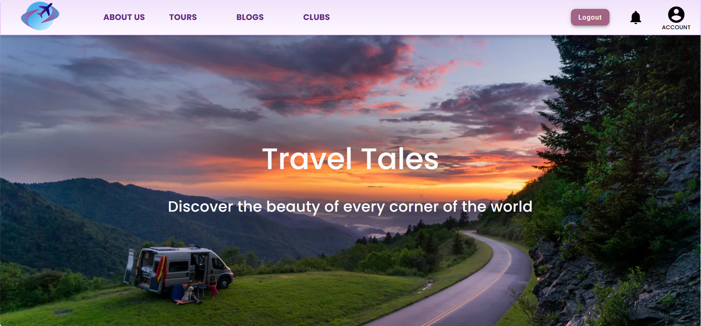
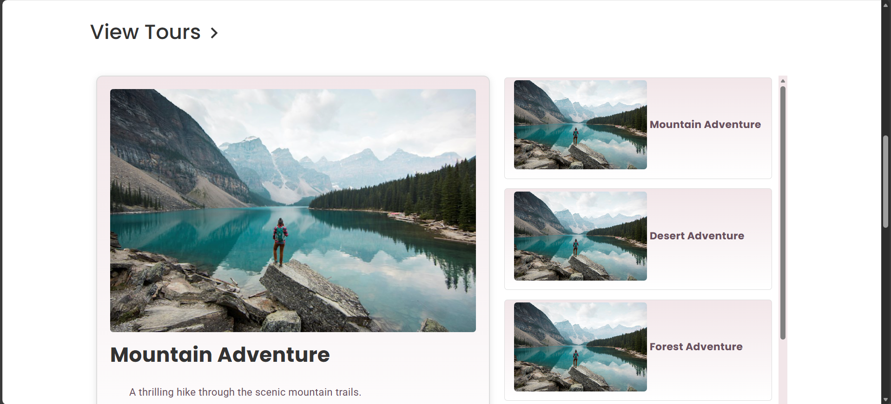
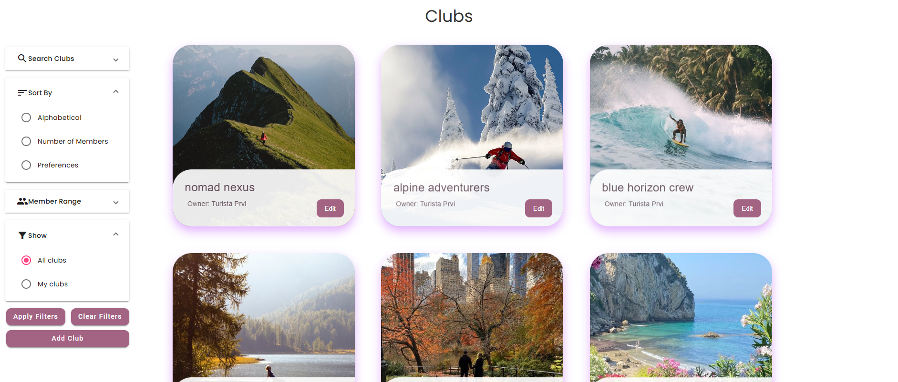
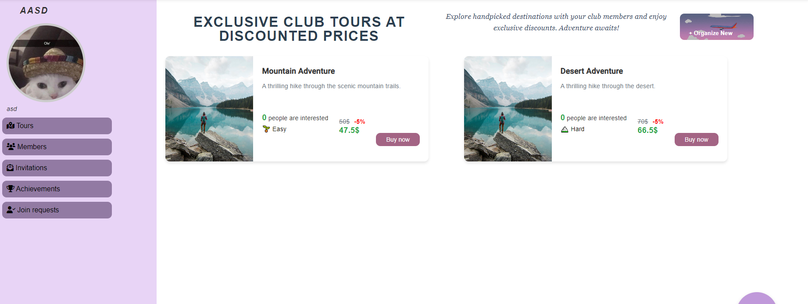
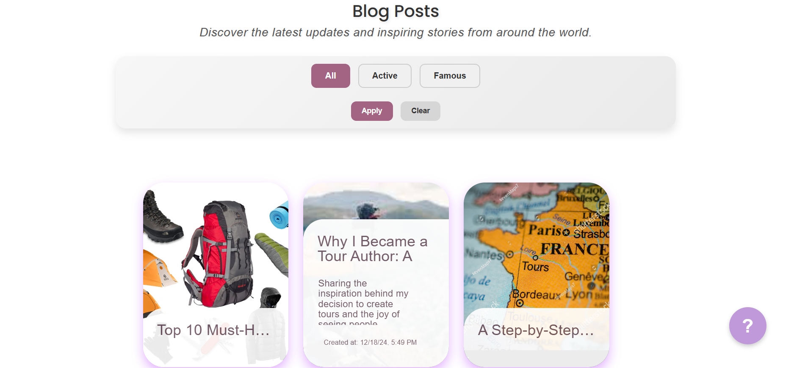
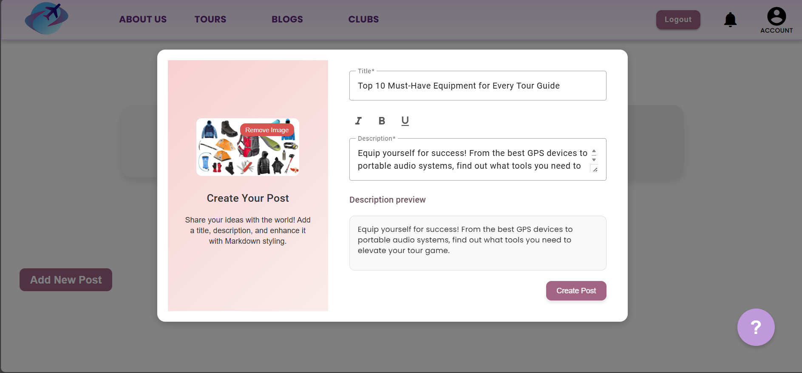
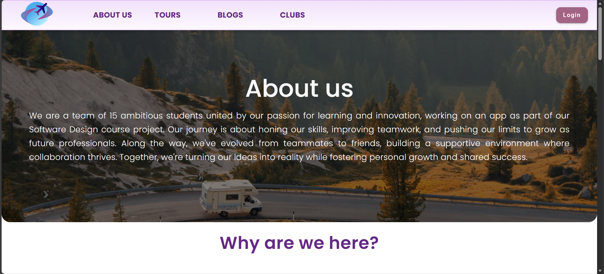
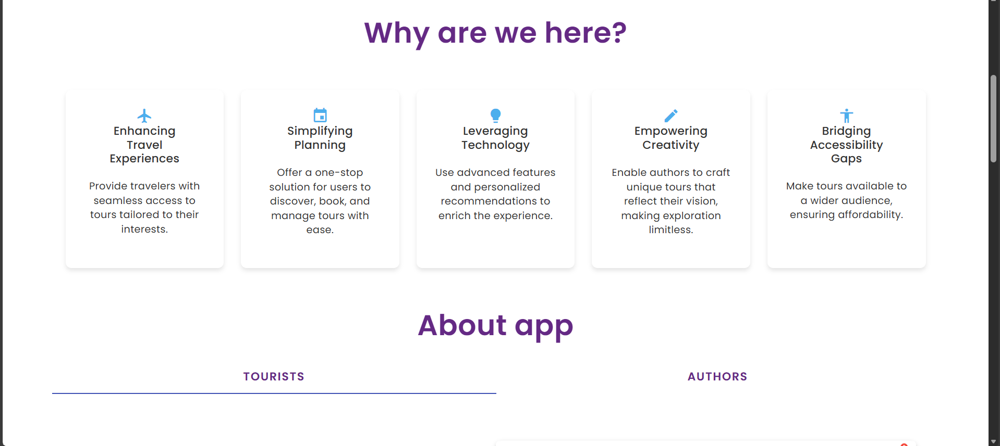
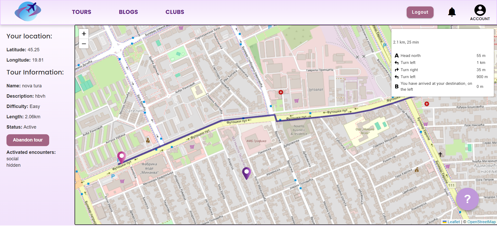
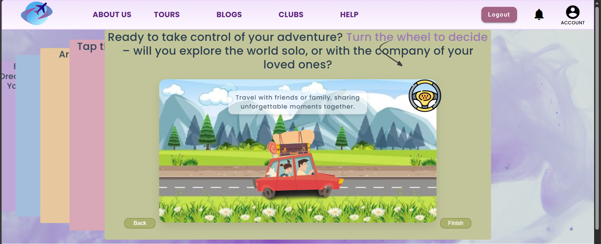
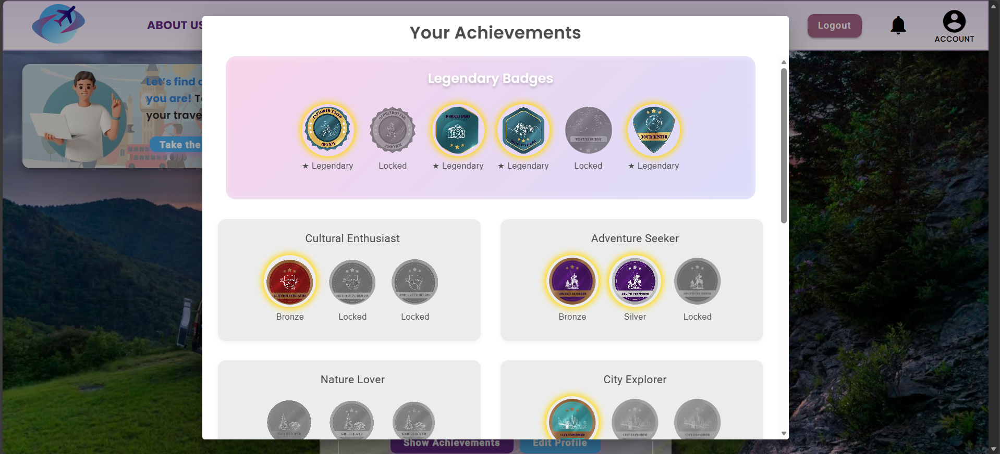
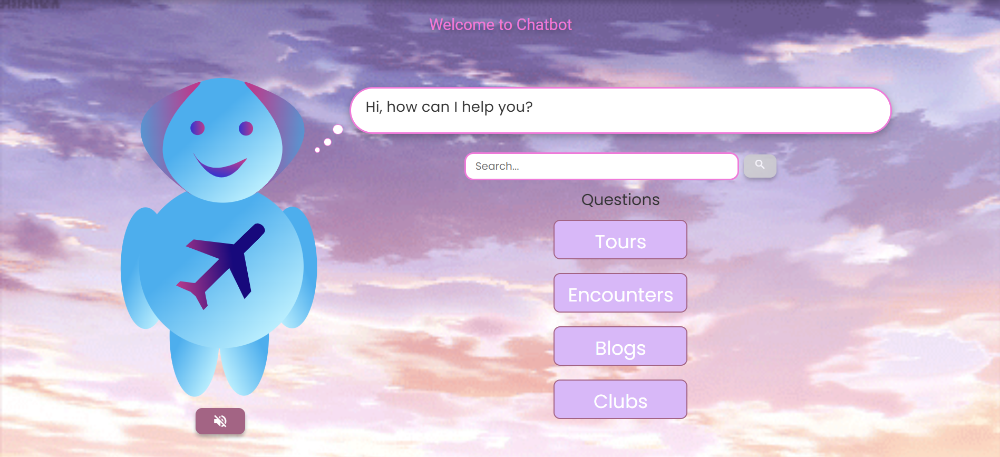
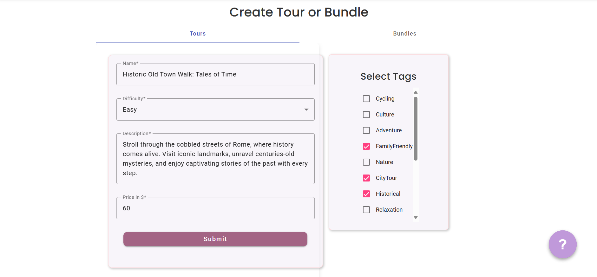

